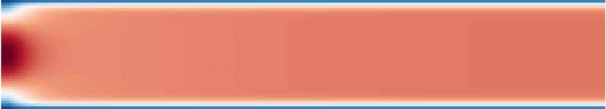

# fvm

Monolithic finite volume codes in 2D.

## Contents

This repository contains a handful of 2D staggered finite volume codes for simple flow problems. The implementations heavily borrow from <a href="https://github.com/saadtony/uCFD">this repository</a>.
The numerical scheme is kept as simple as possible:

- Centered fluxes
- Structured grid
- Incremental pressure correction method

## Results

### Lid-driven cavity

    

### Poiseuille flow

  

### Von Karman flow

### Rayleigh-Benard convection
